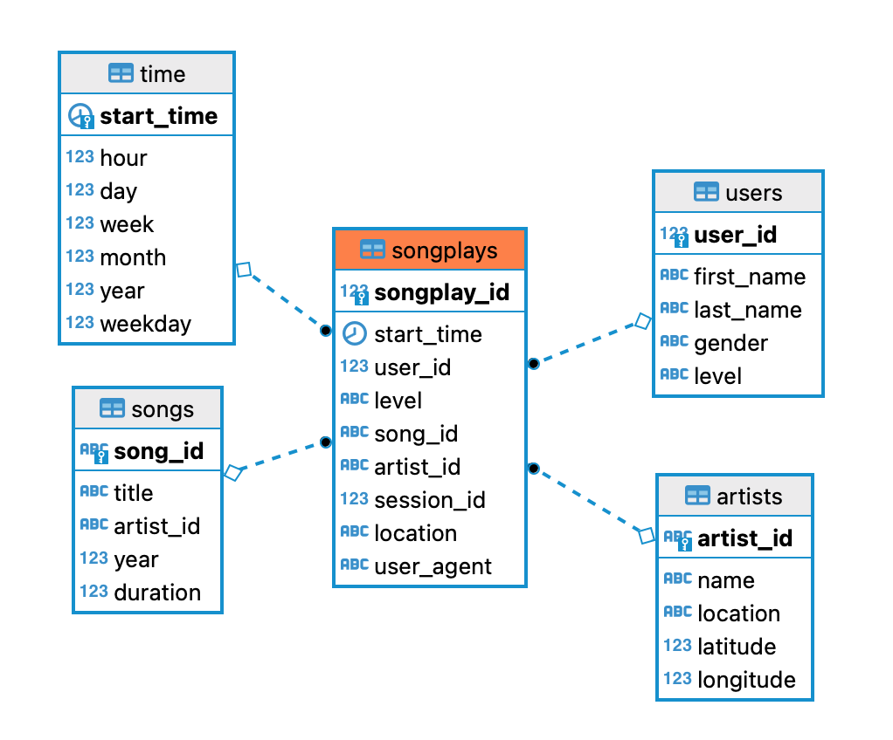

# Datalake

- [About](#about)
- [Data Lake Design](#data-lake-design)
- [ETL Pipeline Design](#etl-pipeline-design)
- [Getting Started](#getting-started)
- [Directory Strucure](#directory-structure)
- [References](#references)

## About

A startup called Sparkify has been growing their user base and wants to move their data to a data lake on S3to continue to be able to analyze the data they've been collecting on songs and user activity on their new music streaming app. Currently, the data resides in S3 and it is required to build an ETL pipeline that extratcs the data from S3, processes them using Spark, and loads the data back into a data lake on S3 as a set of dimensional tables.

## Data Lake Design

### Data

The data resides in S3, in a directory of JSON logs on user activity (```s3://udacity-dend/log_data
```) in the app as well as a directory with JSON metadata on the songs (```s3://udacity-dend/song_data```) in their app.


### Database Schema

Using the song and log datasets, we'll create a star schema optimized for queries on song play analysis. This includes the following tables:

- Fact table: **songplays**.
- Dimension tables: **songs**, **artists**, **users**, **time**. 




## ETL Pipeline Design


The ETL pipline comprises the following components:

- ETL of song data into songs table from song_data JSON files residing in S3.
- ETL of artist data into artists table from song_data JSON residing in S3.
- ETL of time data into time table from log_data JSON files residing in S3.
- ETL of user data into users table from log_data JSON files residing in S3.
- ETL of songplay data into songplays table from log_data JSON files residing in S3.

## Getting Started

### Tech Stack
- PySpark
- AWS S3
- AWS EMR

### Execute ETL Pipeline

Ensure you update the AWS credentials and S3 bucket endpoints in ```dl.cfg``` file.

You can then execute the ETL pipeline by running ```etl.py``` after creation of the EMR cluster.


## Directory Structure

```
├── dl.cfg                      <- Config file 
|
|
└── etl.py                      <- Script to execute ETL pipeline.                           

```

## References

This project is part of the [Udacity Data Engineering nanodegree](https://www.udacity.com/course/data-engineer-nanodegree--nd027).

- [PySpark documentation](https://spark.apache.org/docs/latest/api/python/)
- [Amazon EMR documentation](https://aws.amazon.com/emr/)
- [Markdown guide](https://www.markdownguide.org/basic-syntax/)
